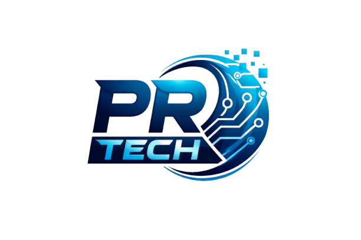

<div align="center">



# PR TECH — Portfolio Website

**Premium Web Design · Software Development · AI Solutions**

[](https://github.com/PrakashWebDevX/PRTECH-PORTFOLIO)
[](https://github.com/PrakashWebDevX/PRTECH-PORTFOLIO/stargazers)
[](https://www.linkedin.com/in/prakashrue)
[](https://www.instagram.com/prak_ash_official)

</div>

---

## 🚀 About This Project

This is the official portfolio website of **PR TECH**, a premium web design & software development agency founded by **Prakash** in March 2026. Built entirely with custom-coded HTML, CSS, and JavaScript — no templates, no page builders — this site reflects the same quality and performance delivered to clients.

> *"No big team, no unnecessary meetings, no wasted hours. Just quality, built fast."*

---

## ✨ Features

| Feature | Description |
|---|---|
| 🖱️ **Custom Cursor** | Magnetic glow cursor with smooth follower animation |
| 🌊 **Infinite Marquee** | Animated tech stack logo scroll with hover tooltips |
| 📊 **Bento Grid** | Modern results/services section with live-chart SVG |
| 🎨 **Glassmorphism UI** | Premium dark aesthetic with green accent (`#00D084`) |
| 💬 **FAQ Accordion** | Smooth open/close animations for all FAQ items |
| 📱 **Fully Responsive** | Optimized for desktop, tablet, and mobile |
| ⚡ **Zero Dependencies** | Pure HTML + CSS + JS — no frameworks, blazing fast |
| 🔍 **On-Page SEO** | Semantic HTML, meta tags, and optimized structure |

---

## 🛠️ Tech Stack


---

## 📁 Project Structure

```
PRTECH-PORTFOLIO/
├── index.html              # Main HTML — all sections
├── styles.css              # All styling, animations & responsive
├── script.js               # Cursor FX, FAQ accordion, interactions
├── PR_Tech_logo.png        # Brand logo (favicon)
├── PRTECH.jpeg             # Founder photo (About section)
├── logo.png                # Secondary logo asset
├── portfolio_law.png       # Portfolio: Legal Associates
├── portfolio_gym.png       # Portfolio: Elite Fitness Club
├── portfolio_restaurant.png# Portfolio: The Culinary Experience
├── portfolio_coffee.png    # Portfolio: Artisan Brews
└── README.md               # You are here
```

---

## 🎯 Sections

- **Hero** — Headline with animated SVG underline + CTA
- **Tech Stack Marquee** — Infinite scroll of tools & technologies
- **Portfolio** — Showcase of 4 real client websites
- **Pricing** — Transparent pricing (Landing Page / Standard)
- **Testimonials** — Client reviews with star ratings
- **Results / Services** — Bento-grid with stats, SEO features & speed scores
- **FAQ** — 7 common questions with smooth accordion
- **AI Products** — RP Vision AI & RP Vision SEO showcase
- **About** — Founder section with stats and GitHub link
- **Footer / Contact** — CTA, social links, availability badge

---

## 💼 Live Portfolio Projects

| Project | Link |
|---|---|
| 🏋️ Elite Fitness Club | [gym-website-gamma-ten.vercel.app](https://gym-website-gamma-ten.vercel.app/) |
| 🍽️ The Culinary Experience | [restaurant-website-lac-seven.vercel.app](https://restaurant-website-lac-seven.vercel.app/) |
| ☕ Artisan Brews | [coffee-shop-website-green.vercel.app](https://coffee-shop-website-green.vercel.app/) |
| 🤖 RP Vision AI | [rp-vision-ai.vercel.app](https://rp-vision-ai.vercel.app) |
| 📈 RP Vision SEO | [rpvisionai.netlify.app](https://rpvisionai.netlify.app) |

---

## 📞 Contact

- 📱 **Phone / Book a Call:** [+91 97873 61860](tel:+919787361860)
- 💼 **LinkedIn:** [linkedin.com/in/prakashrue](https://www.linkedin.com/in/prakashrue)
- 📷 **Instagram:** [@prak_ash_official](https://www.instagram.com/prak_ash_official)
- 🐙 **GitHub:** [PrakashWebDevX](https://github.com/PrakashWebDevX)

---

## 📄 License

© 2026 **PR TECH**. All rights reserved.  
This source code is publicly viewable for portfolio purposes. Please do not reuse or redistribute without permission.

---

<div align="center">

**Built with 💚 by Prakash — founder of PR TECH**

*Premium websites. Real results. Zero compromise.*

</div>
# Portfolio-Website
